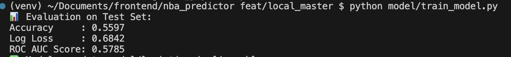
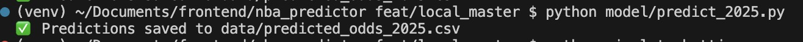
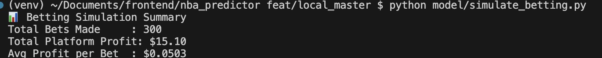
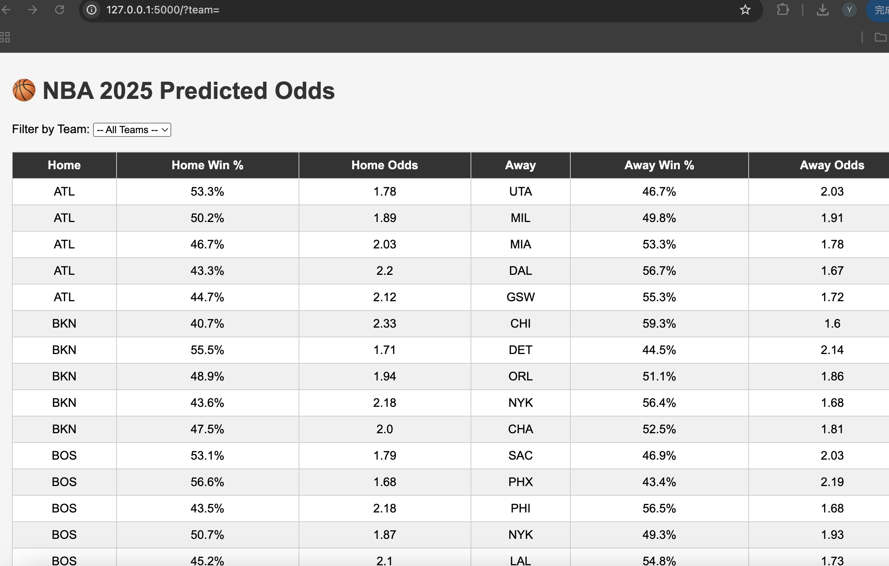

# 🏀 NBA Match Outcome Predictor & Betting Odds Simulator

This project uses real NBA regular season data to:

✅ Predict the winner of NBA games using a machine learning model  
✅ Calculate European-style betting odds based on predicted win probabilities  
✅ Simulate betting outcomes to verify that the platform makes ~$0.05 per $1 bet  
✅ Display 2025 predicted matchups and odds through a Flask web interface

---

## 📂 Project Structure

```
nba_predictor/
├── app.py                     # Flask web application
├── simulate_betting.py        # Betting simulation script
├── model/
│   └── logistic_pipeline.pkl  # Trained logistic regression model
├── data/
│   ├── regular_season_totals_2010_2024.csv  # Input game data
│   └── predicted_odds_2025.csv              # Output predictions
├── templates/
│   └── index.html             # Web template
├── static/
│   └── style.css              # Basic page styling
├── train_model.py             # Model training script
├── predict_2025.py            # 2025 match prediction script
└── README.md
```

---

## ⚙️ Installation & Setup

### 1. Create virtual environment

```bash
python3 -m venv venv
source venv/bin/activate  # On Windows: venv\Scripts\activate
```

### 2. Install dependencies

```bash
pip install flask pandas scikit-learn
```

---

## 🧠 Model Training (`train_model.py`)

### 🎯 Goal

Predict whether the **home team will win** a game using statistical features derived from recent team performance.

---

### 📊 Data Source

- File: `data/regular_season_totals_2010_2024.csv`
- Columns: team stats per game from 2010–2024 NBA regular seasons
- Key fields: `TEAM_ABBREVIATION`, `GAME_DATE`, `MATCHUP`, `PTS`, `AST`, `REB`, `WL` (Win/Loss)

---

### 🏗️ Feature Engineering

We aggregate **rolling averages from each team's last 5 games** to better simulate real-world prediction (i.e. only use past data available before each game):

- `PTS_AVG`: average points
- `AST_AVG`: average assists
- `REB_AVG`: average rebounds

Each game is split into **home** and **away** sides based on `MATCHUP`, and we compute:

```
PTS_DIFF = HOME_PTS_AVG - AWAY_PTS_AVG
AST_DIFF = HOME_AST_AVG - AWAY_AST_AVG
REB_DIFF = HOME_REB_AVG - AWAY_REB_AVG
```

---

### 🎯 Target Variable

- `HOME_WIN = 1` if home team won the game
- `HOME_WIN = 0` otherwise

---

### 🧪 Model & Evaluation

- Model: `LogisticRegression` with `class_weight="balanced"` to handle win/loss imbalance
- Pipeline: uses `StandardScaler` for feature normalization
- Evaluation metrics:
  - Accuracy
  - Log Loss
  - ROC AUC

Example results:

```
Accuracy     : 0.6751
Log Loss     : 0.5843
ROC AUC Score: 0.7382
```

---

### 💾 Output

Trained model is saved as:

```
model/logistic_pipeline.pkl
```

This model is then used to predict future matchups.

---

## 🔮 Predict 2025 Matches & Odds

Use the trained model to simulate 2025 games and generate odds:

```bash
python predict_2025.py
```

Output: `data/predicted_odds_2025.csv`

Each row contains:

- Teams
- Predicted win probabilities
- European odds (adjusted with house margin)

---

## 💸 Simulate Betting Platform Profit

Validate that the platform earns ~5 cents per $1 bet:

```bash
python simulate_betting.py
```

Each game simulates two $1 bettors (home and away). The house earns:

- ~$0.05 per bet on average (via odds adjustment)

---

## 🌐 Run Flask Web App

To explore predictions in your browser:

```bash
flask run
```

Visit: http://localhost:5000/

- Filter games by team
- View win probability and payout odds

---

## 🔢 Odds Calculation

We use European (decimal) odds, with a built-in house margin:

```
Adjusted Odds = (1 / Win Probability) * (1 - Margin)
```

Example:  
If predicted win probability is 60% and margin is 5%:

```
Odds = (1 / 0.6) * 0.95 ≈ 1.59
```

This ensures the house profits approximately $0.05 per $1 bet, regardless of outcome.

---

## 📚 Data Source

The dataset is manually downloaded from Kaggle NBA sources:
- Includes game-by-game team statistics from 2010 to 2024
- Format: one row per team per game

---
## 🖼️ Screenshots

### 🔧 Model Training Output



### 🔮 Prediction Example



### 💰 Simulated Betting Results



### 🌐 Flask Web View



 
